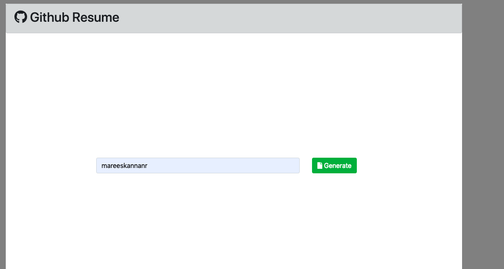
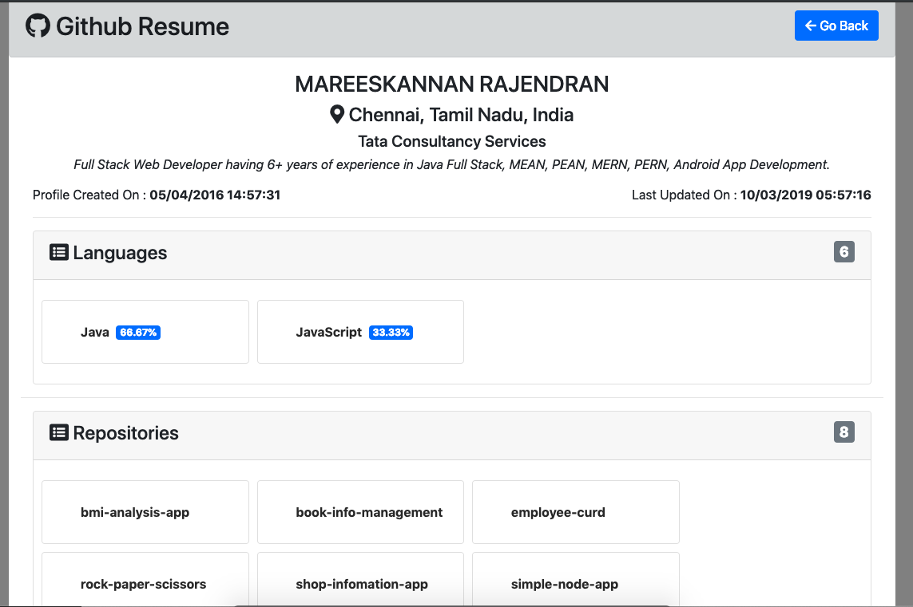
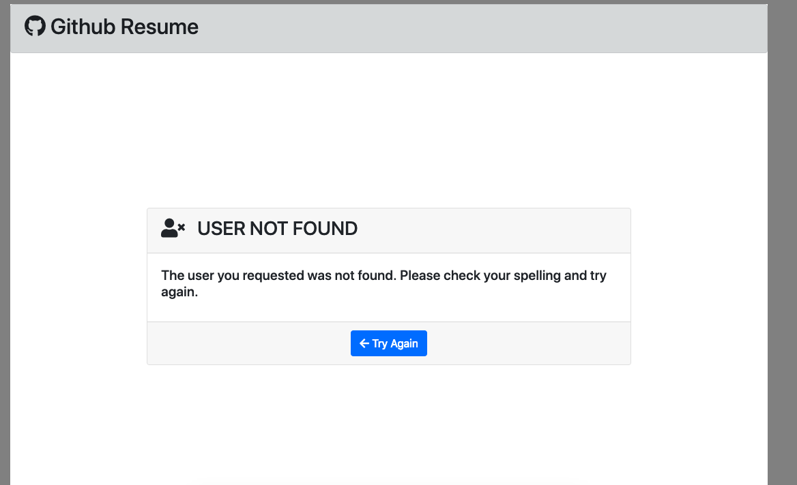

A Simple Resume build using GitHub API.

React, Bootstrap, Font-Awesome are used to create this Github Resume

Goto the root folder and perform "npm install"

Start the server by issuing the following command "npm start"

Now check Application Functionality

Click on the repository or language card, will open them on the new tab.

screen-shots folder contains snaps of various test scenarios.

  
